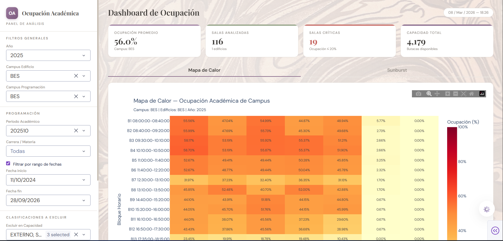
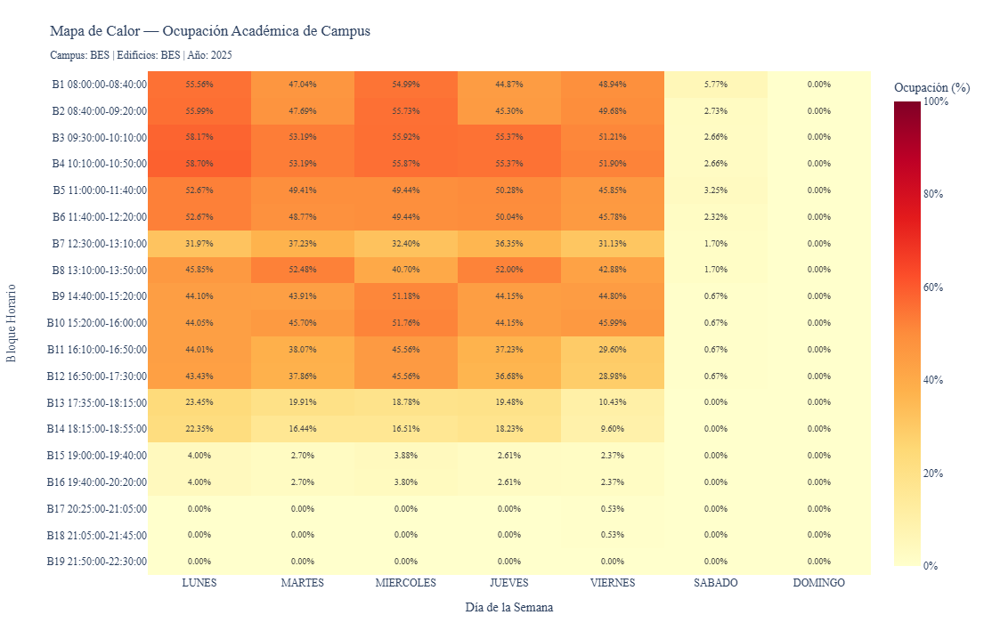
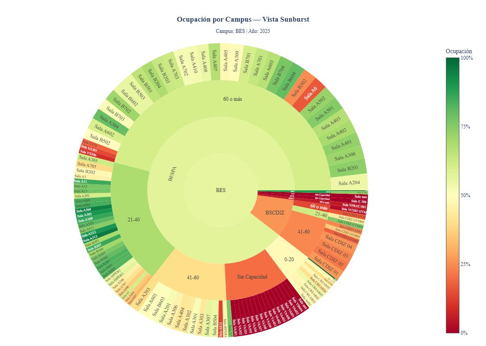
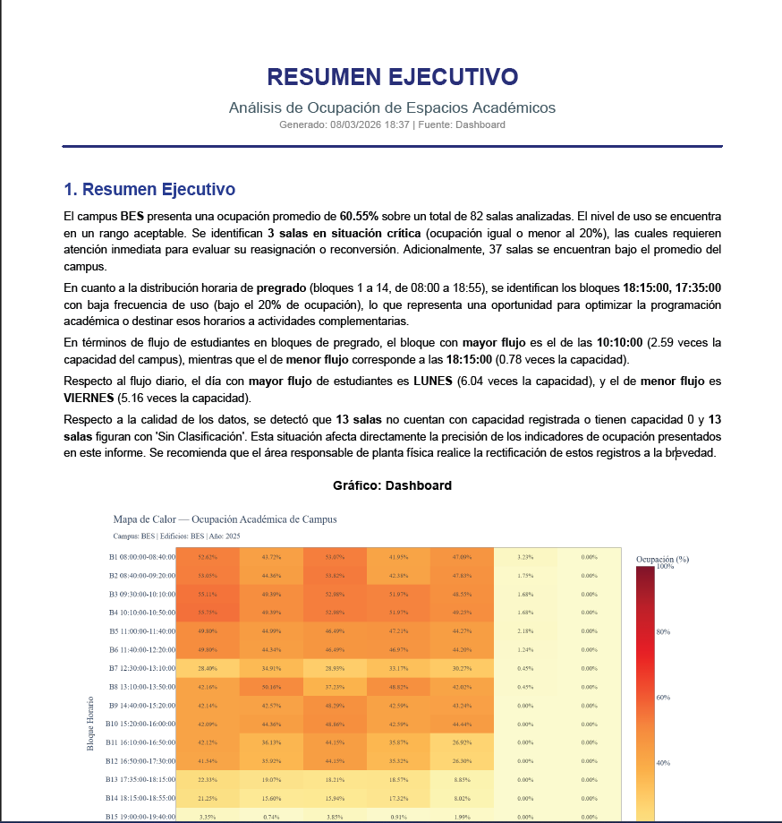
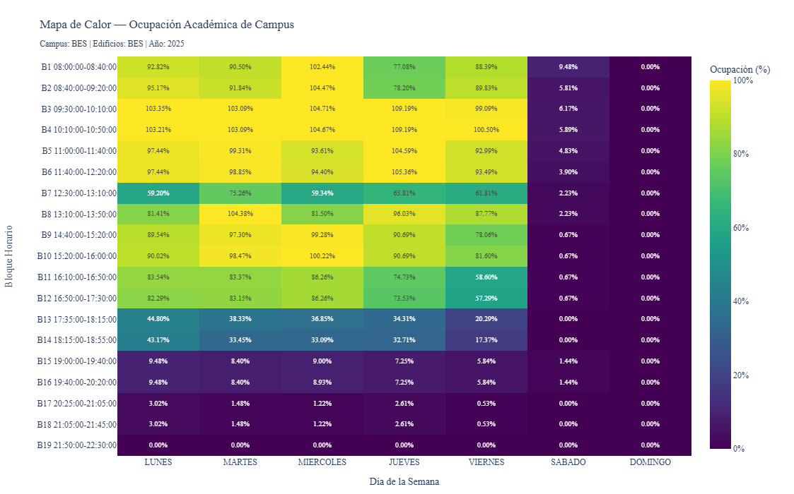
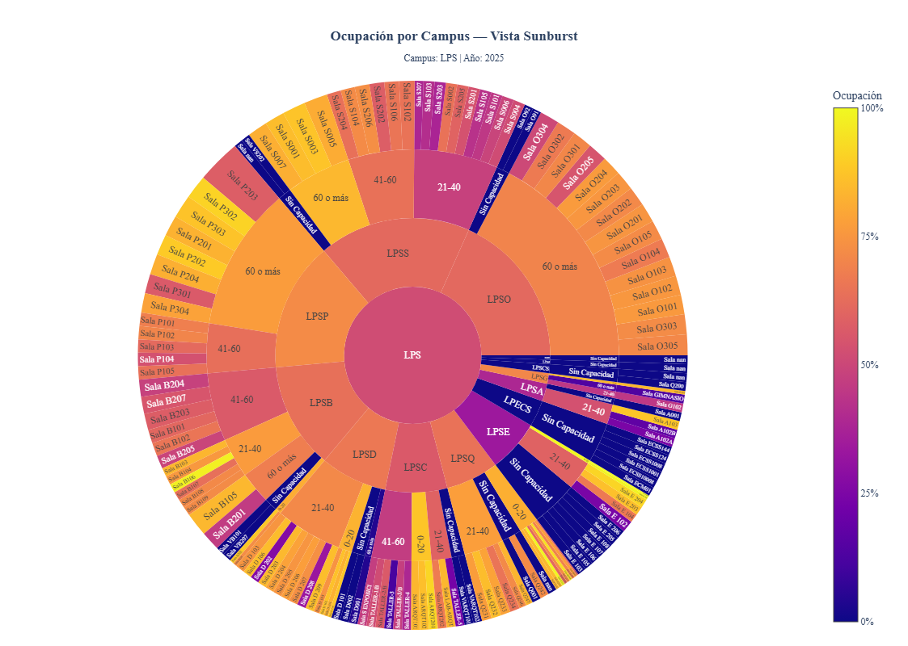
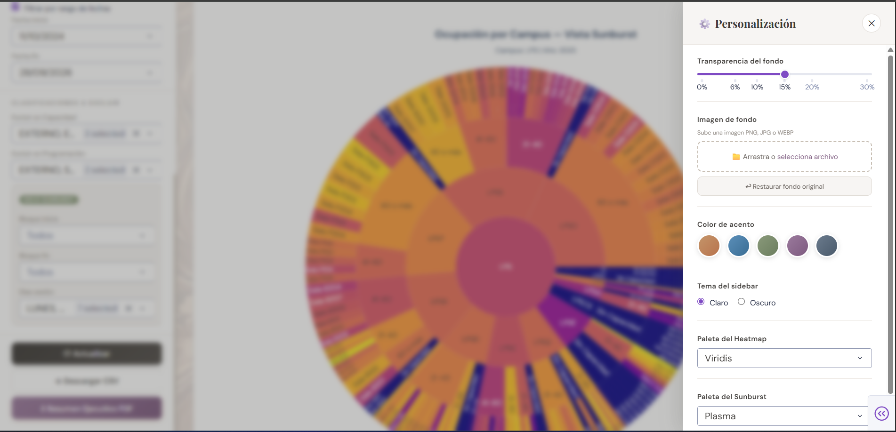

<div align="center">

# 🏛️ Academic Space Occupancy Analytics

### Real-time heatmap & sunburst visualization for university classroom utilization

[](https://python.org)
[](https://plotly.com)
[](https://dash.plotly.com)
[](https://www.reportlab.com)
[](LICENSE)

<br>



<br>

*Transform raw scheduling data into actionable insights about how your campus spaces are really being used.*

</div>

---

## 📋 Table of Contents

- [Overview](#-overview)
- [The Problem](#-the-problem)
- [Our Solution](#-our-solution)
- [Key Indicators](#-key-indicators)
- [Visualizations](#-visualizations)
- [Executive Report (PDF)](#-executive-report-pdf)
- [Methodology](#-methodology)
- [Architecture](#-architecture)
- [Tech Stack](#-tech-stack)
- [Getting Started](#-getting-started)
- [Project Structure](#-project-structure)
- [Screenshots](#-screenshots)
- [Roadmap](#-roadmap)
- [Contributing](#-contributing)
- [License](#-license)

---

## 🎯 Overview

**Academic Space Occupancy Analytics** is a data-driven dashboard designed for university administrators, infrastructure planners, and academic directors to monitor, analyze, and optimize the utilization of physical classroom spaces across multiple campuses.

The platform ingests scheduling data (student enrollments, room assignments, time blocks) and physical infrastructure data (room capacities, building classifications) to produce interactive visualizations and automated executive reports that reveal underutilized spaces, peak demand patterns, and data quality issues.

---

## 🔴 The Problem

Universities worldwide face a common challenge:

> **Millions invested in infrastructure, yet classrooms sit empty while others overflow.**

Without proper analytics, institutions operate blindly:

- ❌ **No visibility** into actual room utilization rates across campuses
- ❌ **Scheduling conflicts** and inefficient room assignments
- ❌ **Capital misallocation** — building new facilities while existing ones are underused
- ❌ **No data-driven basis** for academic scheduling decisions
- ❌ **Inconsistent data** — rooms without capacity records, missing classifications
- ❌ **Cross-campus leakage** — classes scheduled in rooms belonging to different campuses

---

## ✅ Our Solution

A comprehensive analytics platform that turns raw scheduling data into clear, actionable intelligence:

| Feature | Description |
|---------|-------------|
| **Interactive Heatmap** | Time-block × Day matrix showing occupancy percentages across the entire campus |
| **Sunburst Chart** | Hierarchical drill-down from Campus → Building → Room Type → Individual Room |
| **Dynamic Filtering** | 10+ filter dimensions including year, campus, academic period, date range, room classification |
| **Executive PDF Report** | One-click generation with summary, tables, alerts, and recommendations |
| **CSV Export** | Filtered dataset export for further analysis in Excel/Power BI |
| **Customizable UI** | Change themes, colors, background textures, and chart palettes |
| **Responsive Design** | Works on desktop and mobile devices |
| **Local Deployment** | Runs on localhost, accessible from any device on the network |

---

## 📊 Key Indicators

The dashboard computes and displays the following KPIs:

### Campus-Level Metrics

| Indicator | Formula | Purpose |
|-----------|---------|---------|
| **Average Occupancy %** | `mean(OCCUPANCY_RATE)` for all records with valid room | Overall campus utilization |
| **Total Capacity** | `sum(Max Room Capacity)` filtered by selected buildings | Infrastructure baseline |
| **Rooms Analyzed** | `count(distinct ROOM)` with valid records | Scope of analysis |
| **Critical Rooms** | Rooms with average occupancy ≤ 20% | Immediate attention required |

### Time-Block Metrics

| Indicator | Formula | Purpose |
|-----------|---------|---------|
| **Block Occupancy %** | `sum(Enrolled) / (Total Capacity × Days L-F)` | Demand per time slot |
| **Student Flow** | `sum(Enrolled Mon-Fri) / Total Capacity` | How many times campus fills per block |
| **Lowest Demand Blocks** | Blocks with occupancy ≤ 20% (excludes Sat/Sun) | Optimization opportunities |

### Room-Level Metrics

| Indicator | Formula | Purpose |
|-----------|---------|---------|
| **Room Occupancy %** | `mean(OCCUPANCY_RATE)` per room | Individual room performance |
| **Below Campus Average** | Rooms under their campus mean | Distribution inequality |
| **Cross-Campus Alerts** | `CAMPUS ≠ CAMPUS_AUX` (unique rooms) | Data consistency issues |

### Data Quality Metrics

| Indicator | Description | Action Required |
|-----------|-------------|-----------------|
| **Rooms without capacity** | Capacity = 0 or NULL | Update physical plant records |
| **Unclassified rooms** | Classification = "Sin Clasificación" | Assign proper classification |

---

## 📈 Visualizations

### 1. Occupancy Heatmap



A time-block × day-of-week matrix where each cell shows the occupancy percentage for that specific combination. Color intensity reveals demand patterns at a glance:

- **Dark red** = High occupancy (≥ 60%)
- **Yellow/Orange** = Moderate occupancy (20-60%)
- **Light** = Low occupancy (≤ 20%)

**Use cases:**
- Identify peak hours across the week
- Detect underutilized evening/weekend blocks
- Compare weekday demand patterns
- Support scheduling optimization decisions

### 2. Sunburst Chart



A hierarchical radial chart with four concentric levels:

```
Center:  CAMPUS
Ring 2:  BUILDING
Ring 3:  ROOM CAPACITY RANGE (0-20, 21-40, 41-60, 60+)
Ring 4:  INDIVIDUAL ROOM
```

- **Color** = Average occupancy (Green → Yellow → Red)
- **Size** = Room capacity (larger segments = higher capacity)
- **Interactive** = Click to drill down into any level

**Use cases:**
- Compare occupancy across buildings at a glance
- Identify which room sizes are most/least utilized
- Drill into specific rooms for detailed metrics
- Discover patterns by room classification

---

## 📄 Executive Report (PDF)

One-click automated PDF generation containing:



### Report Sections

1. **Executive Summary** — Dynamic paragraph analyzing each campus with occupancy rates, critical rooms count, below-average rooms, time-block patterns, student flow peaks, and data quality alerts

2. **Applied Filters** — Complete record of all filters used for reproducibility

3. **Chart Image** — High-resolution snapshot of the current visualization (Heatmap or Sunburst) embedded directly in the PDF

4. **Full Occupancy Table** — Every room listed with Campus, Building, Classification, Capacity Range, Room ID, and Occupancy %, color-coded:
   - 🔴 Red: ≤ 20%
   - 🟡 Yellow: 20% - 59%
   - 🟢 Green: ≥ 60%

5. **Below-Average Rooms** — Rooms performing under their campus mean, grouped by campus with difference calculated

6. **Critical Rooms (≤ 20%)** — Detailed listing excluding rooms without capacity data

7. **Time-Block Analysis** — Occupancy by hour block and by day (Mon-Fri), with Student Flow metric, excluding weekends

8. **Dynamic Recommendations** — Data-driven recommendations including:
   - Critical room reassignment suggestions (names top 5)
   - Underutilized time-block alerts
   - Distribution inequality warnings
   - Classification-based occupancy insights
   - Cross-campus scheduling alerts
   - Data quality rectification needs

---

## 🔬 Methodology

### Data Pipeline

```
┌─────────────────┐      ┌───────────────────┐     ┌─────────────────┐
│  SCHEDULING DB   │     │  PHYSICAL PLANT   │     │  STANDARD TIME  │
│  (Enrollments,   │     │  (Room capacity,  │     │  BLOCKS         │
│   Room assign.)  │     │   Classifications)│     │  (19 blocks)    │
│                  │     │                   │     │                 │
│  PROG_DETALLADA  │     │  PLANTA_FISICA    │     │  BLOQUES_STD    │
│                  │     │                   │     │                 │
└────────┬─────────┘     └────────┬──────────┘     └────────┬────────┘
         │                        │                          │
         └────────────────┬───────┘──────────────────────────┘
                          │
                   ┌──────▼──────┐
                   │   FILTERS   │
                   │  Year, Campus, Period,  │
                   │  Dates, Classification  │
                   └──────┬──────┘
                          │
              ┌───────────┼───────────┐
              │           │           │
       ┌──────▼──┐  ┌─────▼────┐  ┌──▼───────┐
       │ HEATMAP │  │ SUNBURST │  │ PDF/CSV  │
       │ Engine  │  │ Engine   │  │ Generator│
       └─────────┘  └──────────┘  └──────────┘
```

### Occupancy Calculation Logic

**Heatmap cells:**
```
Occupancy % = sum(Enrolled Students in Block+Day) / Total Campus Capacity × 100
```

**Sunburst rooms:**
```
Room Occupancy = mean(OCCUPANCY_RATE) across all filtered records for that room
```

**Time-block analysis (PDF):**
```
Block Occupancy % = sum(Enrolled) / (Total Capacity × Number of Weekdays with data)
Student Flow = sum(Enrolled Mon-Fri) / Total Capacity
```

### Filtering Logic

- Only records with `REG_UNICO = 1` (unique scheduling records)
- Only records with valid `DIA_SESION` (non-null, non-empty)
- Only records with valid `SALA` (non-null, non-empty, non-NaN)
- Date overlap logic: `record_start ≤ filter_end AND record_end ≥ filter_start`
- Weekend exclusion in time-block analysis (Saturday and Sunday)
- Undergraduate blocks (1-14, 08:00-18:55) for executive summary

---

## 🏗️ Architecture

```
dash_app/
│
├── app.py                          # Main Dash application
│   ├── Layout (Sidebar + Main)     # UI components & filters
│   ├── generar_heatmap()           # Heatmap computation & rendering
│   ├── generar_sunburst()          # Sunburst computation & rendering
│   ├── Callbacks                   # Interactivity & state management
│   └── Customization (JS)         # Clientside callbacks for theming
│
├── utils/
│   ├── data_loader.py              # CSV ingestion & preprocessing
│   └── pdf_generator.py            # Executive PDF report generation
│
├── assets/
│   ├── style.css                   # UI styling (marble aesthetic)
│   └── marble_bg.webp              # Background texture
│
└── BBDD/                           # Data directory (3 CSV files)
```

### Design Decisions

| Decision | Rationale |
|----------|-----------|
| **Dash over Streamlit** | Native Plotly integration, more layout control, better for production dashboards |
| **Clientside callbacks for theming** | Instant UI updates without server roundtrip |
| **ReportLab for PDF** | Full control over layout, tables, colors, and embedded images |
| **Kaleido for chart export** | Server-side Plotly figure rendering to PNG for PDF embedding |
| **dcc.Store for state** | Maintain filter state and customization preferences across interactions |

---

## 🛠️ Tech Stack

| Layer | Technology |
|-------|-----------|
| **Backend** | Python 3.8+ |
| **Web Framework** | Dash 4.0 |
| **Visualization** | Plotly.js (Heatmap, Sunburst) |
| **PDF Generation** | ReportLab |
| **Chart Export** | Kaleido |
| **Data Processing** | Pandas, NumPy |
| **Styling** | Custom CSS (Marble Minimal aesthetic) |
| **Typography** | Playfair Display + DM Sans (Google Fonts) |

---

Open **http://localhost:8050** in your browser.

> 💡 The app listens on `0.0.0.0:8050`, so any device on your local network can access it via your machine's IP address.

---

## 📁 Project Structure

```
Heat-map-University/
│
├── README.md
├── LICENSE
│
├── docs/
│   ├── images/                     # Screenshots & mockups
│   │   ├── dashboard_preview.png
│   │   ├── heatmap_example.png
│   │   ├── sunburst_example.png
│   │   └── pdf_report_preview.png
│   ├── mockup/
│   │   └── preview_dashboard.html  # Interactive UI mockup
│   └── reports/
│       └── sample_executive_report.pdf
│
├── dash_app/
│   ├── app.py                      # Main application
│   ├── utils/
│   │   ├── data_loader.py
│   │   └── pdf_generator.py
│   ├── assets/
│   │   ├── style.css
│   │   └── marble_bg.webp
│   └── BBDD/                       # Data (not published)
│
└── notebooks/
    └──                             # Original Jupyter analysis
```

---

## 📸 Screenshots

<div align="center">

### Dashboard — Heatmap View


### Dashboard — Sunburst View


### Customization Panel


### Executive PDF Report


</div>

---

## 🗺️ Roadmap

- [x] Interactive Heatmap with dynamic filters
- [x] Sunburst hierarchical visualization
- [x] Automated Executive PDF Report with embedded charts
- [x] CSV filtered data export
- [x] UI customization panel (themes, colors, palettes, backgrounds)
- [x] Responsive mobile layout
- [x] Dash web application (localhost deployment)
- [ ] Historical trend analysis (semester-over-semester comparison)
- [ ] Predictive occupancy modeling
- [ ] Room recommendation engine
- [ ] Integration with university ERP/SIS systems
- [ ] Cloud deployment (AWS/Azure)
- [ ] User authentication & role-based access
- [ ] Real-time occupancy via IoT sensors

---

## 🤝 Contributing

Contributions are welcome! Please feel free to submit a Pull Request. For major changes, please open an issue first to discuss what you would like to change.

1. Fork the repository
2. Create your feature branch (`git checkout -b feature/AmazingFeature`)
3. Commit your changes (`git commit -m 'Add some AmazingFeature'`)
4. Push to the branch (`git push origin feature/AmazingFeature`)
5. Open a Pull Request

---
<div align="center">

**Built with ❤️ for better university space management**

*Turning empty classrooms into opportunities.*

</div>
